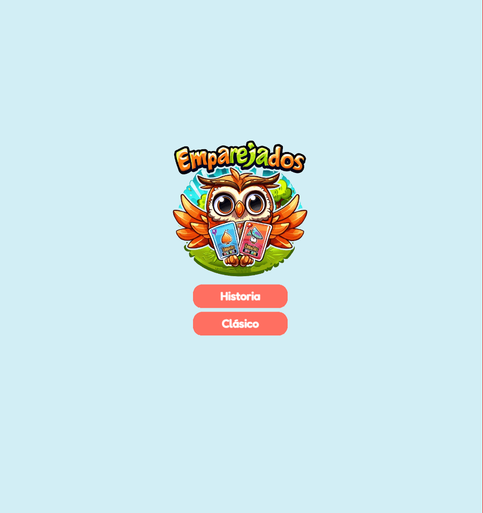

# La Voz De Los Cuentos Games - Phaser Project with Vite

This project uses the "La Voz De Los Cuentos Games" library along with Phaser 3 and Vite for game development. It supports hot-reloading for a fast development workflow and includes scripts to generate production-ready builds.



## Requirements

[Node.js](https://nodejs.org) is required to install dependencies and run scripts via `npm`.

## Available Commands

| Command         | Description                                    |
| --------------- | ---------------------------------------------- |
| `npm install`   | Install project dependencies                   |
| `npm run dev`   | Launch a development web server                |
| `npm run build` | Create a production build in the `dist` folder |

## Installation

To install the project and its dependencies, follow these steps:

1. Clone the repository:
   ```bash
   git clone https://github.com/your-username/la-voz-de-los-cuentos-games.git
   cd la-voz-de-los-cuentos-games
   ```
2. Install

   ```bash
   npm install
   ```

3. Run
   ```bash
   npm run dev
   ```

## Runing / Debugging / QA

You can access the games through:

[http://localhost:8080/](http://localhost:8080/)

You can add search query parameters to set a specific width resolution. For example, to set the width to 720 pixels, use:

[http://localhost:8080/?size=720](http://localhost:8080/?size=720)

This allows you to test your game at different resolutions easily.
